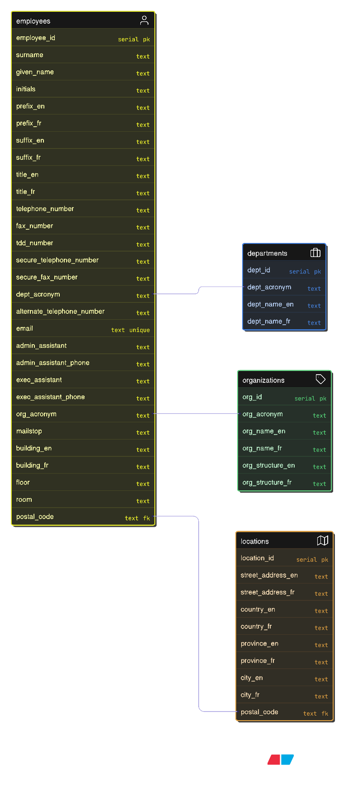

# Employee Directory Project

[](LICENSE)


This project builds a **searchable employee directory** using PostgreSQL and Power BI, based on the [Government of Canada - Federal Employee Directory dataset](https://open.canada.ca/data/en/dataset/8ec4a9df-b76b-4a67-8f93-cdbc2e040098).

The project demonstrates a full **data engineering + analytics workflow**:

* Data profiling & cleaning with Python
* Database schema design in PostgreSQL
* Data modeling concepts (Star Schema, PK–FK relationships)
* Data lineage documentation
* Searchable directory dashboard in Power BI

---

## 📊 Dataset Overview

* Shape: **204,608 rows × 44 columns**

### Key Fields
* **Employee Info**: Surname, GivenName, Initials, Email  
* **Titles**: Title (EN/FR), Prefix, Suffix  
* **Departments**: Acronym, Department Name (EN/FR)  
* **Organizations**: Acronym, Organization Name (EN/FR), Structure (EN/FR)  
* **Contacts**: Telephone Numbers, Fax, Administrative/Executive Assistant  
* **Locations**: Street, City, Province, Postal Code, Country  

### Sample Record

| Surname  | GivenName | Title (EN)          | Department Acronym | Organization Name (EN)            | Telephone Number | Email |
| -------- | --------- | ------------------- | ------------------ | --------------------------------- | ---------------- | ----- |
| Da Silva | Orlando   | Chief Administrator | ATSSC-SCDATA       | Office of the Chief Administrator | NaN              | NaN   |

---

## 🛠️ Tech Stack

* **PostgreSQL** (data warehouse & staging schemas)  
* **Python** (ETL + profiling with `pandas`)  
* **Power BI** (dashboards, visual exploration)  
* **GitHub** (version control, documentation)  

---

## 📂 Repository Structure

```plaintext
Employee-Directory/
│
├── .venv/                     # Virtual environment
├── .vscode/                   # Editor settings
├── .env                       # Environment variables (excluded from VCS)
├── .gitignore / .gitattributes
│
├── data/
│   ├── raw/                   # Original dataset files (CSV)
│   └── processed/             # Cleaned/normalized data
│
├── docs/
│   ├── data_lineage.svg       # Data lineage diagram
│   ├── data_model.png         # ERD / Star Schema
│   ├── ERD code.txt           # ERD definition (Mermaid/DBML)
│   └── project_overview.md    # Documentation
│
├── notebooks/
│   ├── 01_data_profiling.ipynb
│   └── 02_dashboard_wireframes.ipynb
│
├── sql/
│   ├── 01_staging_schema.sql
│   ├── 02_load_data.sql
│   ├── 03_integration_schema.sql
│   ├── 04_etl_process.sql
│   └── 05_presentation_layer.sql
│
├── powerbi/
│   ├── dashboard.pbix         # Power BI report
│   ├── measures.md            # DAX measures
│   └── theme.json             # Power BI theme
│
├── wireframes/
│   ├── directory_dashboard.json
│   ├── employee_profile.json
│   ├── department_overview.json
│   └── _all_documents.json
│
├── CONTRIBUTING.md
├── LICENSE
└── README.md
````

---

## ⚙️ Steps to Reproduce

### 1. Data Profiling & Cleaning (Python)

* Run `01_data_profiling.ipynb` to inspect and clean the dataset.
* Normalize department names, fix nulls, standardize phone/email.
* Save results into `data/processed/`.

### 2. PostgreSQL Setup

1. Create database:

   ```sql
   CREATE DATABASE employee_directory;
   ```
2. Run scripts in order:

   ```bash
   psql -U <user> -d employee_directory -f sql/01_staging_schema.sql
   psql -U <user> -d employee_directory -f sql/02_load_data.sql
   psql -U <user> -d employee_directory -f sql/03_integration_schema.sql
   psql -U <user> -d employee_directory -f sql/04_etl_process.sql
   psql -U <user> -d employee_directory -f sql/05_presentation_layer.sql
   ```

### 3. Data Modeling Concepts

* **Fact Table**: `employees`
* **Dimension Tables**: `departments`, `organizations`, `locations`
* Relationships: PK–FK for department, org, and postal code



### 4. Data Lineage

* **Source**: Open Canada CSV → `data/raw/`
* **Staging**: PostgreSQL staging schema (`stg_employees`)
* **Transform**: ETL scripts → `integration` schema
* **Presentation**: Cleaned tables/views → Power BI


### 5. Power BI Dashboard

* Connect to PostgreSQL using Npgsql connector
* Load presentation views
* Features:

  * Searchable **Employee Directory** (name, department, role)
  * Filters for Department / Role / Location
  * Contact card (phone/email)
  * Department and Organization drilldowns
  * Location map of employees

---

## 🚀 Features

* Searchable **Employee Directory** across **44 fields**
* Multilingual support (**English/French**)
* **Star schema** with dimensions (Departments, Orgs, Locations)
* **Data Lineage** diagram → full ETL visibility
* **ERD** diagram → normalized relational model
* **Power BI Dashboard** with role-based filtering, department overview, and org hierarchy

---

## 🔮 Future Enhancements

* Deploy ETL workflows with Airflow/Prefect
* Automate refresh on Power BI Service
* Expose REST API for employee lookup
* Add predictive analytics (attrition, org size growth)

---

## 📜 License

[MIT License](LICENSE)

---

## 🤝 Contribution

See [CONTRIBUTING.md](CONTRIBUTING.md)
